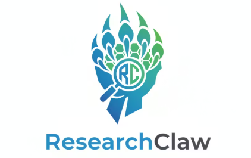

<p align="center">
  
</p>

# ResearchClaw

Experiment 24/7 while you sleep. Research assistant for projects.

> ⚠️ **Alpha Release** — ResearchClaw is in active development. Core loop works, but expect rough edges. Bug reports and feedback welcome: [GitHub Issues](https://github.com/jellyheadandrew/researchclaw/issues)

## Alpha Status

This project is currently alpha and intended for fast iteration.

Known limitations:
- New-experiment loop behavior is still being hardened.
- Abort handling is not yet uniform across every state.
- Autopilot transition audit logging is still being refined.

## Install

```bash
pipx install researchclaw
pipx ensurepath          # one-time: adds ~/.local/bin to PATH
```

Then restart your shell. This works everywhere — bare terminal, conda environments, virtualenvs.

**Alternative** (if pipx is unavailable):

```bash
pip install researchclaw
```

> Note: `pip install` places researchclaw inside your current environment. This may cause dependency conflicts with project packages. Prefer `pipx` + `ensurepath` for an isolated install.

**Fallback** (if `researchclaw` command is not on PATH):

```bash
python -m researchclaw .
```

## Troubleshooting

- **`researchclaw: command not found`** after install — Run `pipx ensurepath` and restart your shell. This adds `~/.local/bin` to your PATH so the command is available in all environments, including conda.

## Usage

```bash
researchclaw .
researchclaw /path/to/project
researchclaw status
```

## What it does NOT do

- Not a paper writing tool — it runs experiments, not LaTeX

---

Built by [Sookwan Han](https://jellyheadandrew.github.io) · ICCV 2023 Oral · ECCV 2024 Oral · CVPR 2025
